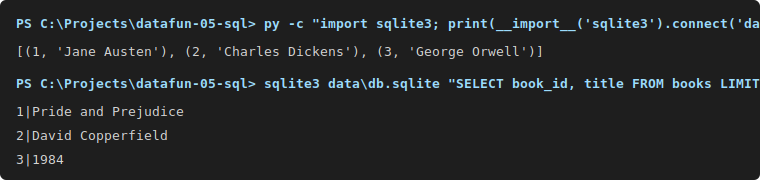

# datafun-05-sql

A tiny, self-contained example project that demonstrates a simple SQLite schema (authors, books) and helper scripts for creating and inspecting the sample data. It's intended for learning and workshop exercises.

Contents
- `data/` — example SQLite database file (`db.sqlite`) when present.
- `sql_files/` — SQL scripts:
  - `create_tables.sql` — CREATE TABLE statements for authors and books
  - `insert_data.sql` — sample INSERT statements
  - `update_data.sql`, `delete_data.sql`, `drop_tables.sql` — sample DML/DDL helpers
- `db_manager.py` — small Python helper to run SQL scripts and inspect the DB
- `requirements.txt` — optional Python dependencies (project works with the standard library)
- `logs/` — runtime logs (not required to run the project)

Why this repo
- Provides a minimal example schema suitable for learning JOINs, constraints, and simple SQL operations.
- Supplies ready-to-run SQL and a tiny Python helper so you can apply, inspect, and modify the sample database.

Prerequisites
- Windows PowerShell (examples below use PowerShell syntax)
- Python 3.8+ (3.11 used in CI for this project)
- sqlite3 CLI (optional). If not installed, the Python `sqlite3` module will be used.

Quick setup

1) (Optional) Create and activate a virtual environment and install requirements:

```powershell
py -m venv .venv; .\.venv\Scripts\Activate.ps1; py -m pip install --upgrade pip; py -m pip install -r requirements.txt
```

2) Create an empty database file and apply the schema + sample data.

Using the sqlite3 CLI (if available):

```powershell
# ensure the data folder exists and database file is present
if (-not (Test-Path data)) { New-Item -ItemType Directory -Path data }
if (-not (Test-Path data\db.sqlite)) { sqlite3 data\db.sqlite ".quit" }

# apply schema and insert data
sqlite3 data\db.sqlite ".read sql_files/create_tables.sql" ";read sql_files/insert_data.sql"
```

Using the bundled Python helper `db_manager.py` (recommended):

```powershell
py db_manager.py --apply-sql sql_files/create_tables.sql sql_files/insert_data.sql
```

Small note: `db_manager.py` accepts multiple SQL files and will apply them in order. See the script's --help for options.

Quick verification

Open a simple REPL query with sqlite3 CLI:

```powershell
sqlite3 data\db.sqlite "SELECT author_id, name FROM authors LIMIT 5;"
sqlite3 data\db.sqlite "SELECT book_id, title, author_id FROM books LIMIT 5;"
```

Or use Python inline to inspect a couple of rows:

```powershell
py - <<'PY'
import sqlite3
conn = sqlite3.connect('data/db.sqlite')
cur = conn.cursor()
cur.execute('SELECT author_id, name FROM authors LIMIT 5')
print(cur.fetchall())
cur.execute('SELECT book_id, title FROM books LIMIT 5')
print(cur.fetchall())
conn.close()
PY
```

Files of interest
- `sql_files/create_tables.sql` — schema creation
- `sql_files/insert_data.sql` — sample data
- `db_manager.py` — convenience script to apply SQL files and run queries
- `requirements.txt` — optional packages

Screenshots
Below are two small mock screenshots (SVG) showing applying the schema and sample query results. View these files in the repo or on GitHub where SVGs render inline.

-   
  Shows applying `create_tables.sql` and `insert_data.sql` via `sqlite3`/PowerShell.

-   
  Example output for a couple of quick verification queries.

Troubleshooting & tips
- Re-running the raw SQL files on an existing database may raise PRIMARY KEY or UNIQUE constraint errors. To make scripts re-runnable, add IF NOT EXISTS to CREATE statements or use DROP TABLE IF EXISTS in `drop_tables.sql` before applying.
- If you see encoding issues when reading SQL files, ensure they are UTF-8 encoded.
- Logs are written to `logs/project_log.log` by the helper logger (if enabled).


